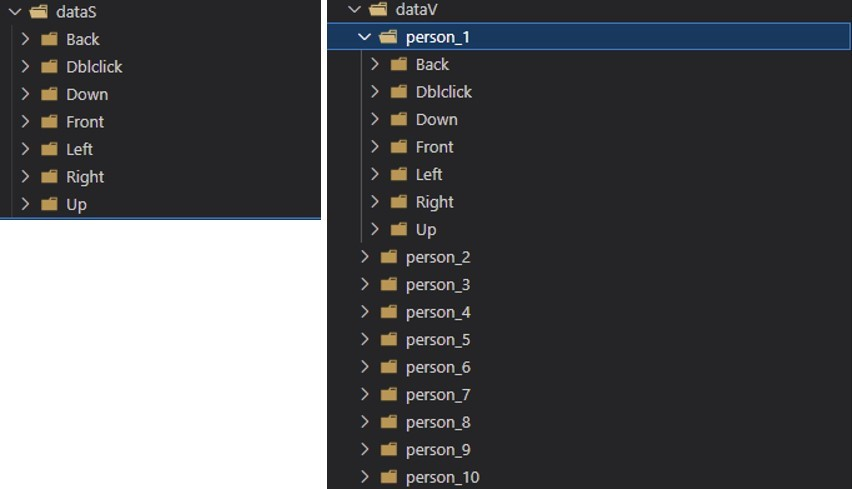
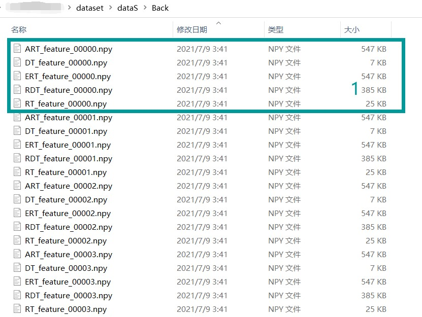

# MIMOGR:MIMO millimeter wave radar multi-feature dataset for gesture recognition

## dataset download link: https://pan.baidu.com/s/195O5mskLnReNWdl1OvSYNg?pwd=3nzd 
## password: 3nzd 

## Instructions: 
&emsp;&emsp;The dataset for this procedure contains two parts: a volunteer-based dataset and a scene-based dataset(abbreviated as __*dataV*__  and __*dataS*__ ). __*dataV*__ consists of seven sets of gestures performed by each of the 10 volunteers in an ideal indoor setting. We labeled these 10 volunteers as P1 to P10, where volunteers P1-P5 were familiar with our defined gestures before the experiment, including the distance from the gesture to the radar, the amplitude and speed of the gesture, etc. During the data collection process, volunteers P1-P5 were asked to perform as many standard gestures as possible. In contrast to the first group, volunteers P6-P10 were not exposed to the system. They were only informed of the system collection process through a brief demonstration by the experimenter, and performed the gestures as naturally as possible. Although the number of volunteers involved was relatively small, we obtained a total of 6847 samples through a long collection period. __*dataS*__ mainly used to validate and improve the generalization performance of our method, consists of 2800 samples from a variety of complex environments and random users, which are closer to real applications.

&emsp;&emsp;Each sample contains five features, including DT, RT, RDT, ERT, and ART feature. DT and RT features are in the format of a 64*64 2D matrix, RDT features are in the format of a 64*64*12 3D matrix, and ERT and ART features are in the format of a 91*64*12 3D matrix, and the data visualization is shown in Figure 10, where ERT, ART, and RDT are the results of multi-frame superposition. From the perspective of intuitive human-computer interaction, the following seven general gestures are designed: waving up, waving down, waving left, waving right, waving forward, waving backward, and double-tap, whose combination can realize most of the human-computer interaction actions.

## Directory Structure:
    .
    ├── dataset                         
        ├── dataS                         # a scene-based dataset
        ├── dataV                         # a volunteer-based dataset
        ├── person_11                     # additional dataset
    ├── figures
        ...                             # pictures
    ├── visualization                   
        ├── code                          # core code
        ├── models    
            ├── datset.py                 # loading dataset          
            ...                           # update soon!
        ├── gesture_icons                 # icons
    ├── README.md
    ├── requirements.txt

## visualization tool:
&emsp;&emsp;The visualization tool has two panels, the first of which is extremely useful when several experiments are required. In the dataset option, you can first choose the dataset source and modify the data ratio for training tests. Then, you can choose various features and models for combination training. Third, after every epoch, the right side of the interface is dynamically updated with loss curves, accuracy curves, and confusion matrices, allowing users to view the training progress visually in real time.

&emsp;&emsp;The second panel is about feature formatting, which can be loaded into the dataset  by the menu in the red box, with options to easily view the results of feature visualization for each type of gesture or for each gesture.
+ Since the ART, ERT, and RDT features are similar to the video form, dynamic cycling of the features can be achieved by using the ‘auto’ button .
+ the features can be mapped to different colors.
+ The ‘recognize’ button in Fig. 6 allows us to load our trained model and predict the gesture type corresponding to the current feature.

# real-time system experimentation
 the gif too large, load slowly!
<table>
  <tbody>
    <tr>
      <td>
        <>
      </td>
      <td>
        <>
      </td>
    </tr>
  </tbody>
</table>

# Reference
Our artical "Motion-Direction Sensitive Features Learning for Gesture Recognition with MIMO mmWave Radar" is undergoing review. updating
